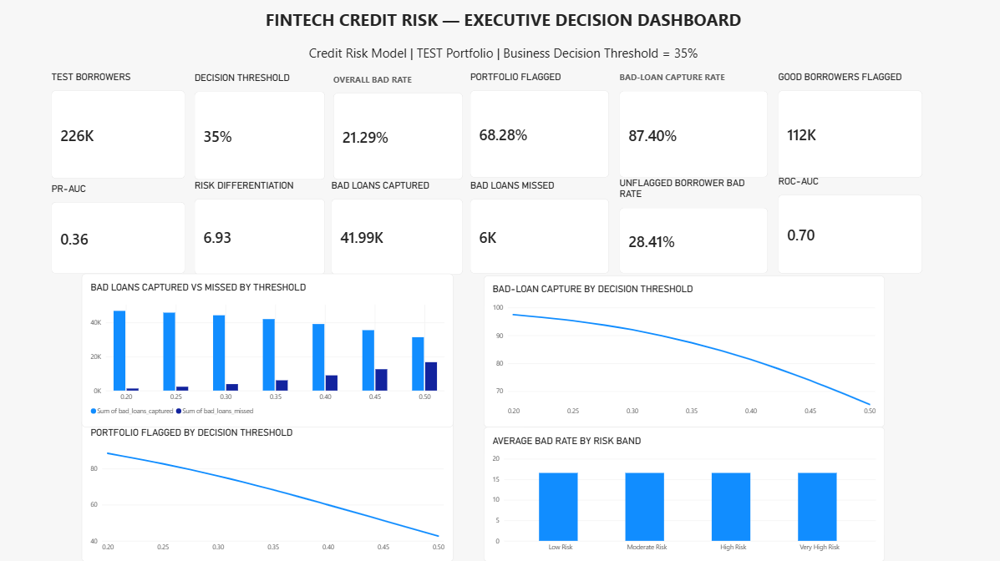

# FinTech Credit Risk & Loan Default Analysis

Business Analytics project analyzing loan default risk and evaluating how different risk-score thresholds affect bad-loan capture, portfolio exposure, and lending decisions.

## Business Problem

A lending business needs to identify borrowers who are more likely to default while avoiding unnecessary rejection or additional scrutiny of good borrowers.

The objective of this analysis was to answer:

- Which borrower characteristics are associated with higher credit risk?
- How effectively can a classification model distinguish higher-risk loans?
- How does changing the risk threshold affect bad-loan capture and portfolio coverage?
- What threshold provides the best decision under a business requirement to capture at least 90% of bad loans?
- How can model outputs be translated into practical lending actions?

## Dataset

The analysis uses LendingClub accepted loan data covering 2007–2018.

The raw dataset contained approximately 2.26 million records. After data-quality checks and removal of unresolved loan outcomes, 1.35 million resolved loans were used for the primary risk analysis.

### Primary Outcomes

| Loan Outcome | Count |
|---|---:|
| Fully Paid | 1,076,751 |
| Charged Off | 268,559 |
| Default | 40 |
| **Total Resolved Loans** | **1,345,350** |

The overall bad-loan rate in the resolved modeling population was approximately **19.97%**.

Unresolved/current loan statuses were excluded from the primary target analysis.

## Approach

### 1. Data Quality & Preparation

- Audited the raw loan dataset for invalid and non-loan records.
- Reviewed missing values across borrower and loan attributes.
- Separated legacy "Does not meet credit policy" records from the primary modeling population.
- Defined a binary credit-risk outcome using resolved loan performance.
- Removed post-origination variables that could introduce target leakage.

### 2. Feature Engineering & Selection

Potential borrower, credit-history, loan, and financial attributes were evaluated.

Post-origination information was excluded so that the model would reflect information available at the time of lending.

Model-based feature selection was then used to reduce the encoded feature space before fitting the final model.

### 3. Predictive Modeling

A class-weighted Logistic Regression model was developed to address the imbalance between good and bad loans.

A temporal validation strategy was used:

- **Training:** 2007–2015
- **Validation:** 2016
- **Test:** 2017–2018

A temporal split provides a more realistic assessment of model performance on future lending populations than a random split across historical records.

## Model Performance

The final model was evaluated on the held-out 2017–2018 test population.

| Metric | Result |
|---|---:|
| ROC AUC | 0.698 |
| PR AUC | 0.306 |

The model provides useful risk ranking, with observed bad-loan rates increasing consistently across model-generated risk segments.

## Risk Segmentation

The test population was divided into four risk bands based on model-predicted risk.

| Risk Band | Borrowers | Actual Bad Rate |
|---|---:|---:|
| Low Risk | 26,064 | 4.70% |
| Moderate Risk | 45,518 | 10.60% |
| High Risk | 57,735 | 18.42% |
| Very High Risk | 96,322 | 32.55% |

The monotonic increase in observed bad-loan rates indicates that the model successfully separates borrowers into progressively higher-risk groups.

## Threshold & Portfolio Impact

Different probability thresholds were evaluated to understand the trade-off between portfolio coverage and bad-loan capture.

| Threshold | Portfolio Flagged | Bad Loans Captured |
|---:|---:|---:|
| 0.20 | 88.45% | 97.45% |
| 0.25 | 82.65% | 95.27% |
| 0.30 | 75.95% | 92.05% |
| 0.35 | 68.28% | 87.40% |
| 0.40 | 59.93% | 81.37% |
| 0.45 | 51.34% | 73.87% |
| 0.50 | 42.69% | 65.27% |

As the threshold increases, fewer borrowers are flagged, but the model also misses a larger proportion of bad loans.

## Business Recommendation

A key business constraint was defined:

> Maintain at least 90% bad-loan capture while reducing the number of borrowers flagged for additional risk review.

Under this constraint, a **0.30 probability threshold** is the highest threshold that still meets the 90% bad-loan capture requirement.

### At a 0.30 Threshold

- **75.95%** of the test portfolio is flagged
- **92.05%** of bad loans are captured
- **44,222** bad loans are captured
- **3,821** bad loans are missed

This represents a practical balance between risk detection and portfolio coverage.

The 0.35 threshold reduces the flagged portfolio further to 68.28%, but bad-loan capture falls to 87.40%, meaning it no longer satisfies the 90% business requirement.

## Key Business Insights

1. **Risk ranking is effective:** observed bad-loan rates increase substantially from Low Risk to Very High Risk segments.

2. **Threshold selection materially changes portfolio impact:** stricter thresholds reduce the number of flagged borrowers but also increase the number of bad loans missed.

3. **The 0.30 threshold is the recommended operating point** when the business requires at least 90% bad-loan capture.

4. **Model probabilities should not be interpreted as calibrated default probabilities:** the model is more useful for ranking and segmentation than treating each predicted probability as a directly calibrated probability of default.

5. **Credit-risk decisions should balance model performance with business constraints**, rather than selecting a threshold solely from a statistical metric.

## Tools Used

- **Python / Scikit-learn** — data preparation, modeling, feature selection, and model evaluation
- **MySQL** — business analysis, threshold evaluation, segmentation, and decision logic
- **Excel** — structured analysis and output review
- **Power BI** — interactive risk and portfolio analysis

## Project Structure

```text
fintech-credit-risk-analysis/
│
├── README.md
│
├── excel/
│   └── portfolio_impact_analysis.csv
│
├── powerbi/
│   └── fintech_credit_risk_dashboard.pbix
│
├── screenshots/
│   └── dashboard-powerbi.png
│
└── sql/
    └── fintech_credit_risk_analysis.sql
```

## Dashboard

The Power BI dashboard presents:

- Model performance
- Risk segmentation
- Threshold trade-offs
- Portfolio impact
- Bad-loan capture
- Model governance considerations



## Project Files

- [SQL Analysis](sql/fintech_credit_risk_analysis.sql)
- [Portfolio Impact Analysis](excel/portfolio_impact_analysis.csv)
- [Power BI Dashboard](powerbi/fintech_credit_risk_dashboard.pbix)

## Business Analytics Takeaway

This project demonstrates how predictive-model outputs can be translated into a practical business decision by connecting **risk modeling, SQL analysis, threshold optimization, and portfolio impact** rather than evaluating model performance in isolation.
